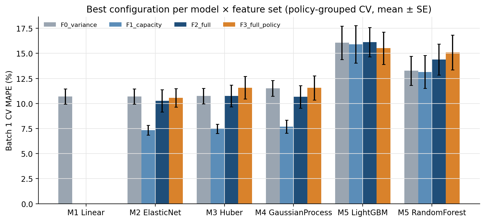
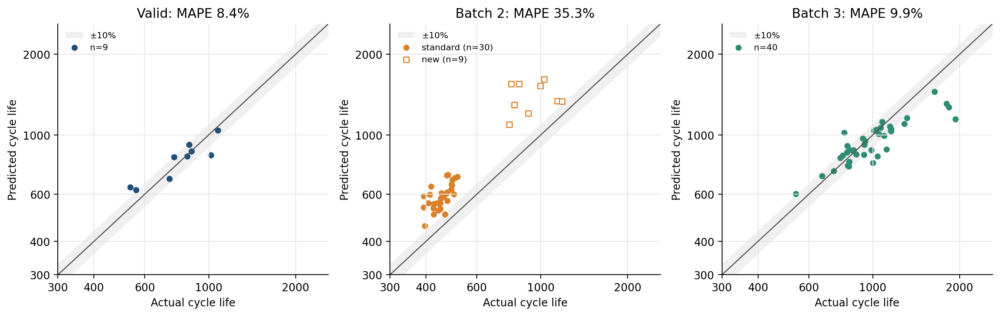
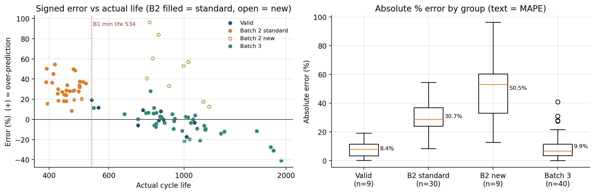
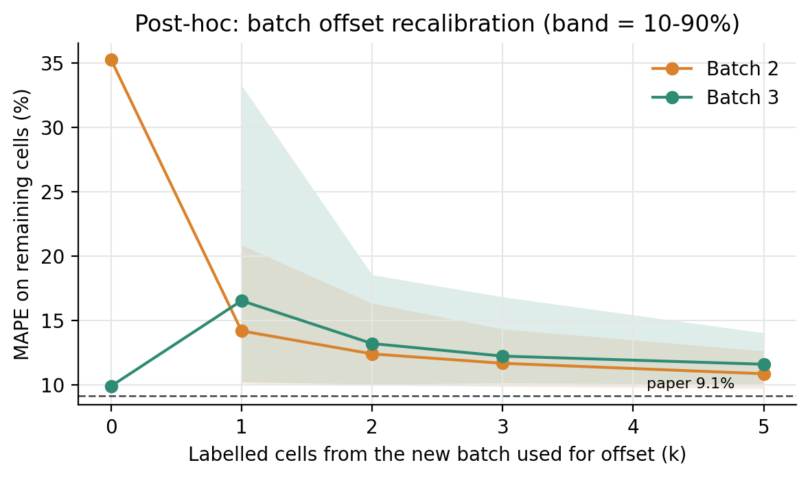

# ESS 배터리 수명 예측

ESS 셀 교체 비용은 설비 CAPEX의 30~40%를 차지합니다. 이 프로젝트는 충방전 **초기 100사이클** 데이터만으로 배터리 셀의 총수명(cycle life)을 예측해, 교체·조달 시점을 미리 계획하고 수명이 짧을 셀을 일찍 골라내는 것을 목표로 합니다.

## 프로젝트 개요

- 데이터셋 : MIT-Stanford Battery Dataset (Severson et al., *Nature Energy* 2019), A123 LFP/흑연 18650 셀, 공칭 1.1Ah
- 학습 데이터 : Batch 1 (2017-05-12)
- 평가 데이터 : Batch 2 (2018-02-20) 필수, Batch 3 (2018-04-12) 추가
- 태스크 : **Regression** (초기 100사이클 → Cycle Life 예측)
- Target : `cycle_life` = 방전 용량이 0.88Ah(공칭의 80%, SOH 80%)에 도달한 사이클 수. 모델은 log10(cycle_life)를 학습하고, 예측값을 원 단위로 되돌려 MAPE를 계산합니다.

| 결과 요약 | MAPE |
|---|---|
| Train (Batch 1 CV) | 7.33% |
| Valid (Batch 1 Hold-out) | 8.44% |
| Test (Batch 2) | 35.30% |
| Test (Batch 3, 추가) | 9.87% |

Batch 1 안과 Batch 3에서는 원논문 목표(9.1%)에 근접했지만, Batch 2는 39셀 전부가 일정한 비율로 과대예측되었습니다. 원인과 개선 방향은 [오류 분석](#오류-분석)에 정리했습니다.

## 파일 구조

```
├── data/
│   ├── README.md                 # 원본 데이터 다운로드·배치 방법
│   └── processed/                # preprocess.py 결과 (원본 없이 바로 학습 가능)
│       ├── cells_meta.csv        # 셀 1개 = 1행: 제공 수명, 충전 정책, 기록 길이
│       ├── summary.csv.gz        # 사이클별 QD·QC·IR·온도·충전시간
│       ├── qdlin.npz             # 공통 전압축 + 셀별 사이클 2·10·100 Qdlin
│       └── features.csv          # features.py 결과 (셀 단위 피처 + 정제 라벨)
├── notebooks/
│   ├── 01_EDA.ipynb              # EDA 5개 질문 × 3배치
│   ├── 02_feature_engineering.ipynb  # 라벨 정제, 피처 정의, 상관·VIF·범위 이탈
│   └── 03_modeling.ipynb         # 후보 비교, 성능표, 오류 분석, 사후 분석
├── src/
│   ├── config.py                 # 경로, 정제 규칙, 시드, 검증 설정
│   ├── preprocess.py             # 원본 MAT(HDF5) → data/processed
│   ├── features.py               # 피처 계산, 라벨 정제, 피처셋 정의
│   ├── split.py                  # 정책 단위 Hold-out, 정책 단위 반복 GroupKFold
│   ├── models.py                 # 후보 모델 M0~M5
│   ├── evaluate.py               # 지표, 성능표, 그림
│   └── train.py                  # 전체 학습·선택·평가 파이프라인
├── results/
│   ├── model_performance.csv     # 과제 Reporting format 성능표
│   ├── metrics_detail.csv        # MAE, 과대예측 비율, 부트스트랩 95% CI, 그룹별 지표
│   ├── cv_results.csv            # 130개 후보 설정의 CV 결과
│   ├── predictions.csv           # Hold-out·Batch 2·Batch 3 셀별 예측
│   ├── worst_cells.csv, sensitivity_labels.csv, reference_by_family.csv, ...
│   └── figures/
├── requirements.txt
└── README.md
```

## 환경 설정

`requirements.txt`의 버전으로 Python 3.10.12에서 원본 MAT 읽기부터 노트북 실행까지 전체를 다시 돌려 이 README의 수치를 확인했습니다.

```bash
git clone https://github.com/hye-on-archive/ess-battery-life-prediction
cd ess-battery-life-prediction
pip install -r requirements.txt
```

## 실행 순서

```bash
# 1) (선택) 원본 MAT → 중간 파일. data/processed/ 가 저장소에 포함되어 있어 생략 가능
python src/preprocess.py --data-dir <MAT 파일 폴더>

# 2) 셀 단위 피처 + 정제 라벨 → data/processed/features.csv
python src/features.py

# 3) 후보 비교 → 모델 선택 → 평가 → results/  (4코어 PC에서 약 30초)
python src/train.py

# 4) 노트북 (results/ 를 읽어 정리)
jupyter notebook notebooks/
```

시드는 `src/config.py`의 `SEED = 42` 하나로 고정했고, Hold-out 정책·CV fold·모델 난수 모두 이 값에서 나옵니다.

## EDA

자세한 그림과 수치는 `notebooks/01_EDA.ipynb`, DAY 1 발표자료에 있습니다.

- **Cycle Life 분포**
  - Batch 1 534~2,237 (중앙 842), Batch 2 392~1,186 (중앙 472, 72%가 500 미만), Batch 3 541~1,935 (중앙 965)
  - 핵심 발견 : Batch 2 기존 구조 30셀은 모두 Batch 1 최소 수명(534)보다 짧아, Batch 2 평가는 학습 범위 밖 외삽입니다. 수명 왜도 1.46 → log10 후 0.27.
- **열화 곡선 분석**
  - 장수명·단수명 셀의 초기 100사이클 용량은 겹치고(초기 평균 용량–수명 ρ 0.1~0.3), 차이는 이후에 벌어집니다.
  - Knee point : 수명의 약 77% 시점, 가장 이른 knee도 244사이클로 입력 구간 이후입니다. 마지막 20% 구간의 감소 기울기는 전체 평균의 약 3.3~3.5배입니다.
  - 핵심 발견 : 용량 값만으로는 100사이클 시점에 수명을 구분하기 어렵습니다. knee는 수명과 사실상 같은 정보라 입력에 넣으면 누수입니다.
- **ΔQ(V) 곡선 분석**
  - ΔQ(V) = Q100(V) − Q10(V). 단수명 셀일수록 3.0V 부근의 골이 깊고 넓습니다.
  - 핵심 발견 : log10 Var(ΔQ)와 수명은 세 배치 모두 강한 음의 상관(ρ −0.88 / −0.71 / −0.76)이며 log–log 평면에서 거의 직선입니다.
- **충전 속도(C-rate)와 수명의 관계**
  - Batch 1은 0→80% 평균 C-rate가 높을수록 수명이 짧습니다(ρ −0.61). Batch 2·3는 모든 정책이 10분 충전(평균 4.8C)이라 총 충전 속도가 같습니다.
  - 핵심 발견 : 충전 조건 효과는 배치마다 방향이 달라 피처로 일반화하기 어렵습니다. 같은 정책 셀이 학습·검증에 섞이지 않게 정책 단위로 분할합니다.
- **(추가) 셀 정제와 배치 효과**
  - Batch 1의 끝 용량 > 0.90Ah인 10셀은 원논문 공식 코드의 정제 대상과 정확히 일치했습니다(이어측정 5셀 수명 보정, EOL 미도달 5셀 제외). Batch 3 노이즈 6셀도 같은 규칙으로 제외했습니다.
  - 초기 평균 용량은 배치 안에서 ρ +0.1~+0.3인데 세 배치를 합치면 −0.49로 뒤집힙니다(배치 효과에 의한 허위 상관).

## Modeling

### DAY 1 전략 → 구현 반영

| DAY 1 전략 | 구현 | 위치 |
|---|---|---|
| Regression, 타깃 log10(cycle_life), MAPE는 원 단위 | 그대로 구현 | `train.fit_predict` |
| 원논문 규칙으로 셀 정제(B1 41, B2 39, B3 40), 제공 라벨은 민감도 | 그대로 구현, 46셀·36셀 민감도 포함 | `features.curate_labels`, `train.label_variant` |
| 정책 단위 Hold-out 5정책 + 정책 단위 GroupKFold 5-fold × 5회 | 그대로 구현 (Hold-out 9셀, Development 17정책·32셀) | `split.py` |
| 피처셋 기본 → 확장 A(용량) → 확장 B(IR·온도), 정책은 보조 | F0 → F1 → F2, F3(정책)은 선택 대상에서 제외 | `features.FEATURE_SETS` |
| 후보 M0~M5 | 130개 설정 비교 | `models.py` |
| 선택은 B1 CV로만, 차이가 작으면 단순한 모델 | 1-SE 규칙으로 자동 선택 | `train.select` |
| 전처리는 fold 안에서만 fit | 결측 대치·표준화를 Pipeline에 포함 | `models._pipe` |

### 피처 엔지니어링 전략

모든 피처는 사이클 100까지의 기록만 씁니다(`src/features.py`).

| 피처 | 정의 | EDA 근거 |
|---|---|---|
| `dq_logvar` | log10 Var_V(Q100(V) − Q10(V)) | Q3 세 배치 공통 최강 신호 |
| `qd_mean` | 사이클 2~100 방전 용량 평균 (0 < QD < 1.5Ah) | Q2 용량 정보의 추가 몫 |
| `qd_slope` | 사이클 10~100 방전 용량 기울기 (mAh/cycle) | Q2 초기 감소 속도 |
| `ir_change` | IR(91~100) − IR(2~10), IR > 0만 (mΩ) | Q5 저항 변화 |
| `tavg_median` | 사이클 평균 온도의 중앙값 (°C) | Q5 발열, 극단값에 강함 |
| `avg_crate_0_80`, `switch_soc` | 정책 문자열로 계산한 0→80% 평균 C-rate, 전환 SOC | Q4, 보조 실험(F3)만 |

ΔQ 최솟값·평균은 log 분산과 VIF 수백으로 중복이라, 왜도·첨도는 Batch 2·3에서 약해서 제외했습니다. 기본 피처셋 F2의 VIF는 모두 2.1 이하입니다.

### 모델 선택 및 근거

- 후보 모델 : M0 중앙값 기준선, M1 단일 피처 선형회귀, M2 ElasticNet, M3 Huber, M4 Gaussian Process(선형+RBF 커널), M5 RandomForest·LightGBM
- 최종 모델 : **ElasticNet (alpha=0.001, l1_ratio=0.9) + F1 피처셋** (`dq_logvar`, `qd_mean`, `qd_slope`)
- 선택 이유 :
  - Batch 1 CV에서 F1 조합이 모든 선형 계열에서 가장 좋았습니다(ElasticNet 7.33%, Huber 7.48%, GP 7.68%). 단일 피처(F0)는 10.70%, 저항·온도를 더한 F2는 10.26%, 정책까지 더한 F3는 10.57%로 오히려 나빴습니다.
  - 트리 계열은 RandomForest 13.15%, LightGBM 15.91%로 소표본(학습 32셀)에서 가장 나빴고, 구조상 학습 범위 밖을 예측하지 못합니다.
  - 선형 계열은 log–log 직선 관계(Q3)를 그대로 쓰고 범위 밖으로 외삽할 수 있으며, ElasticNet은 L1·L2 규제로 공선성과 소표본 과적합에 대응합니다.
  - 표준화 계수(log10 수명): `dq_logvar` −0.157, `qd_mean` +0.032, `qd_slope` −0.016. ΔQ가 예측을 주도합니다.
  - 딥러닝은 독립 표본이 학습 셀 수십 개뿐이라 쓰지 않았습니다.



## 성능 결과

고정 모델(Development 32셀로 학습)로 한 번씩 평가했습니다. Gap은 (+)가 성능 저하가 되도록 계산했습니다.

| 구분 | MAPE (%) | 비고 |
|---|---:|---|
| Train (Batch 1 CV) | 7.33 | 정책 단위 GroupKFold 5-fold × 5회 검증 fold 평균 (표준편차 2.42) |
| Valid (Batch 1 Hold-out) | 8.44 | 학습에 쓰지 않은 B1 충전 정책 5개 (9셀) |
| Test (Batch 2) | 35.30 | 최종 필수 평가 (39셀), 부트스트랩 95% CI 29.6~41.2 |
| Gap (Train-Valid) | +1.11 | Valid − Train, (+) : 과적합 의심 |
| Gap (Valid-Test) | +26.86 | Test − Valid, (+) : 배치간 일반화 저하 의심 |
| Gap (Target-Test) | +26.20 | Test − 9.1, Target : 원논문 9.1% |
| Test (Batch 3) | 9.87 | 추가 평가 (40셀), 부트스트랩 95% CI 7.3~12.7 |
| Gap (Batch2-Batch3) | −25.43 | Batch 3 − Batch 2, Test 성능 간 비교 |
| Gap (Target-Test), Batch 3 | +0.77 | Batch 3 − 9.1, 원논문 성능 비교 |

| 보조 지표 | Valid | Batch 2 | Batch 3 |
|---|---:|---:|---:|
| MAE (사이클) | 64 | 210 | 120 |
| 평균 부호 오차 (%) | +2.2 | +35.3 | −4.8 |
| 과대예측 셀 비율 | 44% | 100% | 45% |
| 예측–실제 순위 상관 (Spearman) | 0.92 | 0.84 | 0.84 |

Gap 해석
- **Train−Valid +1.1%p** : 학습에 없던 충전 정책 5개에서도 CV와 비슷해, Batch 1 안에서는 과적합이 크지 않습니다.
- **Valid−Test +26.9%p** : 배치가 바뀌자 성능이 크게 떨어졌습니다. Batch 3에서는 9.9%로 유지되어, 배치 간 일반화 실패가 Batch 2에 집중되어 있습니다.
- **Target−Test +26.2%p** : 원논문의 테스트셋은 2017-06-30 배치이고 과제의 Batch 2(2018-02-20)는 다른 배치입니다. 같은 조건 재현 성능으로 해석하지 않습니다. 원논문의 2차 테스트셋에 해당하는 Batch 3는 목표와 0.8%p 차이입니다.



민감도(선택한 설정 고정, `results/sensitivity_labels.csv`)

| 라벨 버전 | B1 셀 | CV | Valid | Batch 2 | Batch 3 |
|---|---:|---:|---:|---:|---:|
| 원논문 규칙 (주 결과) | 41 | 7.33 | 8.44 | 35.30 | 9.87 |
| 제공 라벨 그대로 | 46 | 9.83 | 7.20 | 53.63 | 19.34 |
| 의심 10셀 모두 제외 | 36 | 6.64 | 8.93 | 35.38 | 10.82 |

제공 라벨을 그대로 쓰면 이어측정 셀의 수명이 실제보다 짧게 들어가 모든 평가가 나빠집니다. 10셀을 빼도 Batch 2 결과가 같으므로, Batch 2 오차는 라벨 처리 때문이 아닙니다.

## 오류 분석



**모델이 가장 크게 틀린 셀의 공통점**

1. **Batch 2 전체의 일정한 과대예측** : 39셀 모두 과대예측, 평균 log10 오프셋 +0.13(약 1.34배). 그런데 배치 안 순위는 유지됩니다(Spearman 0.84). 같은 ΔQ 분산이라도 Batch 2 셀은 Batch 1보다 일찍 EOL에 도달합니다. 단일 피처 모델로도 Batch 2 기존·new 구조 모두 log 오프셋 +0.09로 비슷하게 밀려 있어, 특정 피처가 아니라 배치 자체의 차이입니다.
2. **Batch 2 new structure 9셀이 최악 (MAPE 50.5%)** : ΔQ는 Batch 1 장수명 셀처럼 건강해 보이는데(학습 범위 안) 실제로는 777~1,186사이클에서 끝납니다(최대 오차 b2c009, 실제 791 → 예측 1,552). 여기에 Batch 2의 초기 용량이 학습 범위보다 높아(39셀 중 20셀 범위 밖) 양(+)의 계수를 가진 `qd_mean`이 예측을 더 끌어올립니다. EDA에서 본 허위 상관(배치 안 +, 합치면 −)이 실제 오차로 나타났습니다.
3. **Batch 3 최장수명 셀(1,800사이클 이상) 27~41% 과소예측** : 학습 셀 중 1,400사이클 이상은 이어측정 보정 5셀뿐이라 예측이 평균 쪽으로 당겨집니다.
4. **Hold-out 최단수명 2셀(534·559) 12~19% 과대예측** : 학습 범위보다 짧고 ΔQ도 범위 밖인 외삽 구간입니다.

**원인 가설과 개선 방향**

| 관찰 | 원인 가설 | 개선 방향 |
|---|---|---|
| B2 전체 과대예측, 순위는 유지 | 실험 시기·셀 lot·측정 조건 차이로 같은 ΔQ에서 수명이 짧음 | 새 배치 초기 셀 몇 개로 오프셋 보정, 여러 배치를 함께 학습 |
| `qd_mean`이 B2에서 범위 밖 | 절대 용량 수준은 lot·장비 보정에 따라 달라짐 | 절대 용량 대신 상대 변화 피처, 입력이 범위를 벗어나면 단순 모델(F0)로 전환 |
| 최장수명 셀 과소예측 | 학습에 장수명 셀이 적음 | 장수명 셀 확보, 예측 구간(GP)을 함께 보고 |

**사후 분석(탐색, 테스트 정답을 본 뒤 수행)** : 오차가 배치 오프셋이라면 새 배치 셀 몇 개의 실제 수명으로 보정할 수 있습니다. Batch 2 셀 3개로 오프셋을 추정해 나머지 셀을 보정하면 MAPE 35.3% → 11.7%, 5개면 10.8%입니다. 반대로 오프셋이 없던 Batch 3에 같은 보정을 하면 9.9% → 11.6~16.5%로 나빠지므로, 보정은 배치 차이가 확인될 때만 써야 합니다. 참고로 단일 피처 선형 모델(M1)의 Batch 2 MAPE는 24.7%였지만, 이 역시 테스트 결과를 본 뒤의 비교라 모델 선택에는 쓰지 않았습니다.



## ESS 도메인 해석

**실제 BESS에 적용한다면 어떤 의사결정에 쓸 수 있는가**
- **설치 초기 셀 선별과 팩 구성** : 배치가 달라도 예측 순위는 유지되었습니다(Spearman 0.84~0.92). 100사이클 시점에 수명이 짧을 셀을 골라 같은 모듈에 섞지 않거나, 점검 우선순위를 정하는 데 쓸 수 있습니다.
- **교체·조달 계획** : 학습과 같은 조건의 셀(Hold-out, Batch 3)에서는 오차가 8~10%로, 1,000사이클 셀이면 약 ±100사이클 안에서 교체 시점을 계획할 수 있습니다. knee 이후 급락이 오기 전에 발주 일정을 잡는 근거가 됩니다.
- **새 lot·새 공급사 도입 시 검증 절차** : Batch 2처럼 배치가 바뀌면 같은 모델이 일괄 과대예측할 수 있습니다. 새 lot의 소수 셀을 기준 시험으로 끝까지 돌려 오프셋을 보정하는 절차를 함께 두어야 합니다.

**과대예측의 운영 위험** : 수명 과대예측은 교체 준비가 늦어지는 방향의 오류입니다. Batch 2처럼 전 셀이 같은 방향으로 틀리면 예비 셀 부족, 피크 대응 용량 부족, 계약 위약 위험이 한꺼번에 생깁니다. 그래서 MAPE만이 아니라 과대예측 비율과 입력 분포 이탈 경보를 함께 운영 지표로 둬야 합니다.

**한계와 실 배포에 필요한 것**
- 실험 조건 : 30°C 챔버, 0→80% 고속 충전과 4C 완전 방전의 반복입니다. 실제 ESS는 부분 충방전, 달력 열화, 온도 변동, 팩 안 셀 편차가 있어 그대로 옮길 수 없습니다.
- 입력 측정 : ΔQ는 사이클 10과 100의 완전 방전 곡선이 필요합니다. 현장에서는 정기 기준 성능 시험(RPT)으로 같은 조건의 방전 곡선을 확보해야 합니다.
- 데이터 규모 : 학습 셀 41개(모델 개발 32개), 배치 3개로 배치 효과의 원인을 확정할 수 없습니다. 여러 lot·온도·SOC 범위의 데이터와 배치 정보를 함께 학습하는 구조가 필요합니다.
- 라벨 : 이어측정 5셀의 보정 수명은 과제 데이터에 없는 파일(2017-06-30)에서 온 원논문 값입니다.
- EOL 정의 : 셀 용량 80%는 교체 기준일 뿐, 팩 고장이나 안전사고 시점이 아닙니다.
- 평가 : Batch 2·3는 EDA 단계에서 이미 관찰했으므로 완전한 블라인드 평가가 아닙니다. 모델 선택은 Batch 1 결과로만 했습니다.

## 참고문헌

- Severson, K. A. et al. (2019). Data-driven prediction of battery cycle life before capacity degradation. *Nature Energy*, 4, 383–391.
- 원논문 데이터 처리 코드 : https://github.com/rdbraatz/data-driven-prediction-of-battery-cycle-life-before-capacity-degradation (`Load Data.ipynb`, `LoadData.m`)
- 데이터 : https://www.kaggle.com/datasets/itshpark/data-driven-prediction-of-battery-cycle (원출처 https://data.matr.io/1/)

## 팀 구성

- 조승현 (SKALA 4기 울산캠퍼스 1반) : EDA, 피처 엔지니어링, 모델 개발, 성능 평가(Batch 2·3), 오류 분석
